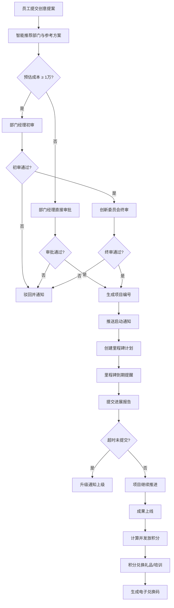

## 1. 产品概述

企业员工创意创新管理APP是一个面向企业内部的创新管理平台，旨在激发员工创造力，规范化创意提案从提交到落地的全流程管理。通过智能推荐、自动化审批、积分激励等功能，构建企业创新生态。

- 解决问题：企业创意提案管理分散、审批流程不透明、创新激励机制缺失
- 目标用户：企业员工、部门经理、创新委员会成员、系统管理员
- 产品价值：提升创新效率，加速创意落地，建立可持续的创新文化

## 2. 核心功能

### 2.1 用户角色

| 角色 | 核心权限 |
|------|----------|
| 普通员工 | 提交创意提案、查看个人提案进度、查看积分、兑换礼品 |
| 部门经理 | 审批1万元以下提案、初审1万元以上提案、查看部门数据 |
| 创新委员会 | 终审1万元以上提案、查看全局创新数据、调整评审重点 |
| 系统管理员 | 看板管理、用户权限、数据导出、系统配置 |

### 2.2 功能模块

1. **首页/工作台**：数据概览、待办事项、快捷入口
2. **创意提案**：提案列表、新建提案、智能推荐、提案详情
3. **审批中心**：待我审批、审批记录、审批流程可视化
4. **项目管理**：项目列表、里程碑计划、进度报告、通知提醒
5. **积分中心**：积分明细、兑换商城、兑换记录、电子兑换码
6. **管理员看板**：部门数据统计、筛选分析、报表导出、趋势预测

### 2.3 页面详情

| 页面名称 | 模块名称 | 功能描述 |
|----------|----------|----------|
| 工作台 | 数据概览卡片 | 展示提案数、待审批、进行中项目、积分余额 |
| 工作台 | 待办事项列表 | 待审批、待提交报告、通知消息 |
| 工作台 | 快捷入口 | 一键提交提案、快速查看热门创新 |
| 创意提案列表 | 筛选搜索 | 按状态、部门、时间筛选 |
| 创意提案列表 | 提案卡片 | 标题、状态标签、预估成本、提交时间 |
| 新建提案 | 表单区域 | 标题、描述、预期收益、所需资源、预估成本 |
| 新建提案 | 智能推荐 | 关联部门推荐、相似案例参考方案 |
| 审批中心 | 待审批列表 | 展示待处理审批项，显示紧急程度 |
| 审批中心 | 审批详情 | 提案信息、审批流程、审批意见输入 |
| 项目管理 | 项目列表 | 项目编号、名称、进度、负责人 |
| 项目管理 | 里程碑计划 | 时间轴展示、到期提醒、进度报告提交 |
| 积分中心 | 积分概览 | 当前积分、累计获得、已兑换 |
| 积分中心 | 兑换商城 | 礼品列表、兑换操作、库存显示 |
| 积分中心 | 兑换记录 | 历史兑换、电子兑换码展示 |
| 管理员看板 | 统计图表 | 提案数、采纳率、项目进度、兑换率 |
| 管理员看板 | 筛选控件 | 部门筛选、时间范围选择 |
| 管理员看板 | 预测分析 | 热门创新领域预测、评审重点建议 |
| 管理员看板 | 报表导出 | 月度创新报表导出 |

## 3. 核心流程

### 3.1 创意提案提交流程
员工登录系统后，进入创意提案页面填写提案信息（标题、描述、预期收益、所需资源、预估成本）。系统根据关键词和历史数据智能推荐关联部门和相似案例作为参考。提交后系统根据预估成本自动分配审批流程。

### 3.2 审批流程
- 预估成本 < 1万元：部门经理直接审批，通过后直接生成项目
- 预估成本 ≥ 1万元：部门经理初审 → 创新委员会终审 → 通过后生成项目
- 审批通过后自动生成唯一项目编号并推送启动通知给相关人员

### 3.3 项目执行与跟踪
系统根据项目信息自动创建里程碑计划。每个里程碑到期前3天推送通知给负责人提交进展报告。若超时未提交（超过截止日期1天），系统自动升级通知至上级主管。

### 3.4 积分激励流程
创造成果上线后，根据实际收益（节省成本、增收金额）自动计算积分并发放给项目团队。积分可在兑换商城兑换节日礼物或培训名额，兑换成功后生成电子兑换码。

### 3.5 流程可视化

## 4. 用户界面设计

### 4.1 设计风格

**整体风格**：专业商务风 + 创新科技感

- **主色调**：深海蓝 `#1e3a5f` - 代表专业与信任
- **辅助色**：创新青绿 `#00c9a7` - 代表创新与活力
- **强调色**：活力橙 `#ff7a45` - 用于重点提醒和CTA按钮
- **中性色**：石墨灰 `#2c3e50`、浅灰 `#f5f7fa`、白色 `#ffffff`

**按钮样式**：
- 圆角设计（8px），带有微妙的悬停阴影效果
- 主按钮采用渐变填充，次按钮采用描边样式
- 危险操作用红色系区分

**字体方案**：
- 标题字体：`Noto Sans SC` - 粗重现代，突出层级
- 正文字体：`PingFang SC` - 清晰易读，适合长时间阅读
- 数字字体：`Inter` - 等宽数字，便于数据对比

**布局风格**：
- 左侧导航栏 + 顶部状态栏 + 主内容区的经典后台布局
- 卡片式内容承载，卡片带有细微边框和阴影
- 充足的留白空间，营造专业感
- 数据可视化区域采用图表与数字卡片结合

**图标风格**：
- 使用 Lucide 图标库，线性风格，统一 24px 尺寸
- 关键操作带有微动效反馈

### 4.2 页面设计概述

| 页面名称 | 模块名称 | UI元素 |
|----------|----------|--------|
| 工作台 | 数据概览卡片 | 渐变背景、大号数字、趋势箭头、图标点缀 |
| 工作台 | 待办事项 | 列表布局、紧急程度色标、倒计时显示 |
| 创意提案列表 | 提案卡片 | 网格布局、状态标签色、成本标签、悬浮效果 |
| 新建提案 | 表单区域 | 分区表单、智能推荐浮层、实时字数统计 |
| 新建提案 | 智能推荐 | 侧边栏展示、相似案例卡片、部门匹配度百分比 |
| 审批中心 | 审批流程 | 时间轴流程展示、当前节点高亮、审批意见气泡 |
| 项目管理 | 里程碑计划 | 垂直时间轴、进度条、完成状态对勾、提醒图标 |
| 积分中心 | 兑换商城 | 商品网格卡片、库存标签、兑换按钮动效 |
| 积分中心 | 兑换码展示 | 二维码 + 数字码、复制按钮、有效期显示 |
| 管理员看板 | 统计图表 | 柱状图、折线图、环形图、数据筛选联动 |
| 管理员看板 | 预测分析 | 热力图展示、趋势预测曲线、AI建议卡片 |

### 4.3 响应式设计

- **设计策略**：Desktop-first，针对平板和移动端进行适配优化
- **桌面端（≥1280px）**：完整布局，侧边导航展开，多列数据展示
- **平板端（768px-1279px）**：侧边导航收起为图标模式，数据列适当减少
- **移动端（<768px）**：顶部汉堡菜单导航，单列布局，重点信息优先展示
- **触控优化**：按钮最小点击区域 44×44px，列表项增加垂直间距

### 4.4 动效与交互细节

- 页面加载：元素依次淡入上滑（staggered reveal）
- 卡片悬停：轻微上浮 + 阴影加深
- 按钮点击：缩放反馈（scale 0.98）
- 状态变化：过渡动画 300ms ease-out
- 通知提示：从右侧滑入，自动消失或手动关闭
