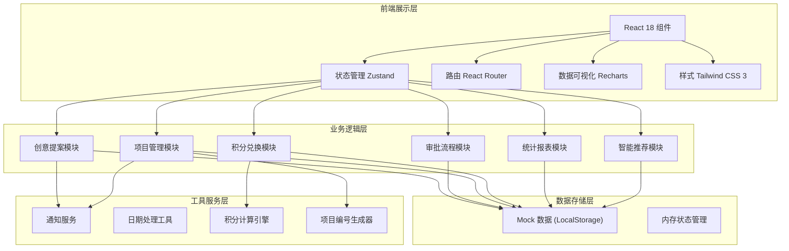
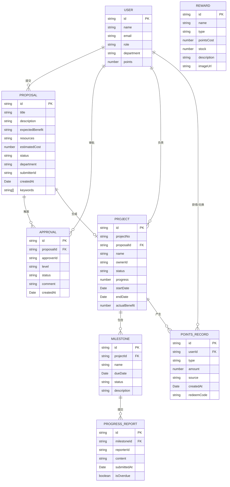

## 1. 架构设计



## 2. 技术描述

- **前端框架**：React 18 + TypeScript
- **构建工具**：Vite 5
- **状态管理**：Zustand 4
- **路由管理**：React Router DOM 6
- **样式方案**：Tailwind CSS 3
- **图标库**：Lucide React
- **数据可视化**：Recharts 2
- **数据持久化**：LocalStorage（Mock 数据）
- **后端**：无（纯前端实现，使用 Mock 数据）

## 3. 路由定义

| 路由路径 | 页面名称 | 说明 |
|----------|----------|------|
| `/` | 工作台 | 首页，数据概览、待办事项 |
| `/proposals` | 创意提案列表 | 展示所有提案，支持筛选 |
| `/proposals/new` | 新建创意提案 | 提案表单 + 智能推荐 |
| `/proposals/:id` | 提案详情 | 查看单个提案信息与审批流程 |
| `/approvals` | 审批中心 | 待审批、审批记录 |
| `/approvals/:id` | 审批详情 | 审批操作页面 |
| `/projects` | 项目管理 | 项目列表、里程碑 |
| `/projects/:id` | 项目详情 | 项目信息、里程碑进度 |
| `/points` | 积分中心 | 积分概览、兑换商城 |
| `/points/records` | 积分记录 | 积分明细与兑换记录 |
| `/admin` | 管理员看板 | 数据统计、报表导出、预测分析 |

## 4. 数据模型

### 4.1 核心数据实体



### 4.2 数据类型定义

```typescript
// 用户角色
type UserRole = 'employee' | 'manager' | 'committee' | 'admin';

// 提案状态
type ProposalStatus = 'draft' | 'pending' | 'approved' | 'rejected' | 'project_created';

// 审批级别
type ApprovalLevel = 'manager' | 'committee';

// 审批状态
type ApprovalStatus = 'pending' | 'approved' | 'rejected';

// 项目状态
type ProjectStatus = 'planning' | 'in_progress' | 'completed' | 'delayed';

// 里程碑状态
type MilestoneStatus = 'pending' | 'in_progress' | 'completed' | 'overdue';

// 积分记录类型
type PointsType = 'earn' | 'redeem';

// 奖励类型
type RewardType = 'gift' | 'training';

interface User {
  id: string;
  name: string;
  email: string;
  role: UserRole;
  department: string;
  avatar?: string;
  points: number;
}

interface Proposal {
  id: string;
  title: string;
  description: string;
  expectedBenefit: string;
  resources: string;
  estimatedCost: number;
  status: ProposalStatus;
  department: string;
  submitterId: string;
  createdAt: Date;
  keywords: string[];
  recommendedDepartments?: string[];
  similarCases?: SimilarCase[];
}

interface SimilarCase {
  id: string;
  title: string;
  department: string;
  matchRate: number;
  result: 'success' | 'failed';
}

interface Approval {
  id: string;
  proposalId: string;
  approverId: string;
  level: ApprovalLevel;
  status: ApprovalStatus;
  comment: string;
  createdAt: Date;
}

interface Project {
  id: string;
  projectNo: string;
  proposalId: string;
  name: string;
  ownerId: string;
  status: ProjectStatus;
  progress: number;
  startDate: Date;
  endDate: Date;
  actualBenefit: number;
  milestones: Milestone[];
}

interface Milestone {
  id: string;
  projectId: string;
  name: string;
  dueDate: Date;
  status: MilestoneStatus;
  description: string;
  reports: ProgressReport[];
}

interface ProgressReport {
  id: string;
  milestoneId: string;
  reporterId: string;
  content: string;
  submittedAt: Date;
  isOverdue: boolean;
}

interface PointsRecord {
  id: string;
  userId: string;
  type: PointsType;
  amount: number;
  source: string;
  createdAt: Date;
  redeemCode?: string;
  rewardId?: string;
}

interface Reward {
  id: string;
  name: string;
  type: RewardType;
  pointsCost: number;
  stock: number;
  description: string;
  imageUrl: string;
}

interface Notification {
  id: string;
  userId: string;
  type: 'info' | 'warning' | 'success' | 'error';
  title: string;
  content: string;
  isRead: boolean;
  createdAt: Date;
  relatedId?: string;
  relatedType?: string;
}

interface DepartmentStats {
  department: string;
  proposalCount: number;
  approvalRate: number;
  projectCount: number;
  completionRate: number;
  totalPoints: number;
  redeemRate: number;
}
```

## 5. 项目结构

```
src/
├── components/          # 公共组件
│   ├── Layout/         # 布局组件
│   │   ├── Sidebar.tsx
│   │   ├── Header.tsx
│   │   └── index.tsx
│   ├── Proposal/       # 提案相关组件
│   ├── Approval/       # 审批相关组件
│   ├── Project/        # 项目相关组件
│   ├── Points/         # 积分相关组件
│   ├── Admin/          # 管理员看板组件
│   ├── charts/         # 图表组件
│   └── ui/             # 基础UI组件
├── pages/              # 页面组件
│   ├── Dashboard.tsx
│   ├── Proposals.tsx
│   ├── NewProposal.tsx
│   ├── ProposalDetail.tsx
│   ├── Approvals.tsx
│   ├── ApprovalDetail.tsx
│   ├── Projects.tsx
│   ├── ProjectDetail.tsx
│   ├── Points.tsx
│   ├── PointsRecords.tsx
│   └── Admin.tsx
├── store/              # Zustand 状态管理
│   ├── useAuthStore.ts
│   ├── useProposalStore.ts
│   ├── useApprovalStore.ts
│   ├── useProjectStore.ts
│   ├── usePointsStore.ts
│   └── useNotificationStore.ts
├── data/               # Mock 数据
│   ├── users.ts
│   ├── proposals.ts
│   ├── projects.ts
│   ├── rewards.ts
│   └── notifications.ts
├── utils/              # 工具函数
│   ├── date.ts
│   ├── points.ts
│   ├── projectNo.ts
│   ├── recommend.ts
│   └── export.ts
├── types/              # TypeScript 类型定义
│   └── index.ts
├── hooks/              # 自定义 Hooks
│   ├── useNotifications.ts
│   └── useDebounce.ts
├── App.tsx
├── main.tsx
└── index.css
```

## 6. 关键业务逻辑

### 6.1 审批分流规则
- 当 `estimatedCost < 10000`：只需要部门经理一级审批
- 当 `estimatedCost >= 10000`：需要部门经理初审 + 创新委员会终审

### 6.2 项目编号生成规则
格式：`INNO-{年份}-{4位自增序号}`，例如：`INNO-2026-0001`

### 6.3 积分计算规则
- 节省成本：每 100 元 = 1 积分
- 增收金额：每 200 元 = 1 积分
- 项目完成额外奖励：50-200 积分（根据项目规模）

### 6.4 里程碑通知规则
- 到期前 3 天：推送提醒通知给负责人
- 到期当天：再次推送紧急提醒
- 超期 1 天：自动升级通知至上级主管

### 6.5 智能推荐算法
- 基于关键词匹配（TF-IDF 简化版）
- 部门关联度历史数据分析
- 相似案例：关键词重合度 + 部门匹配 + 结果参考
